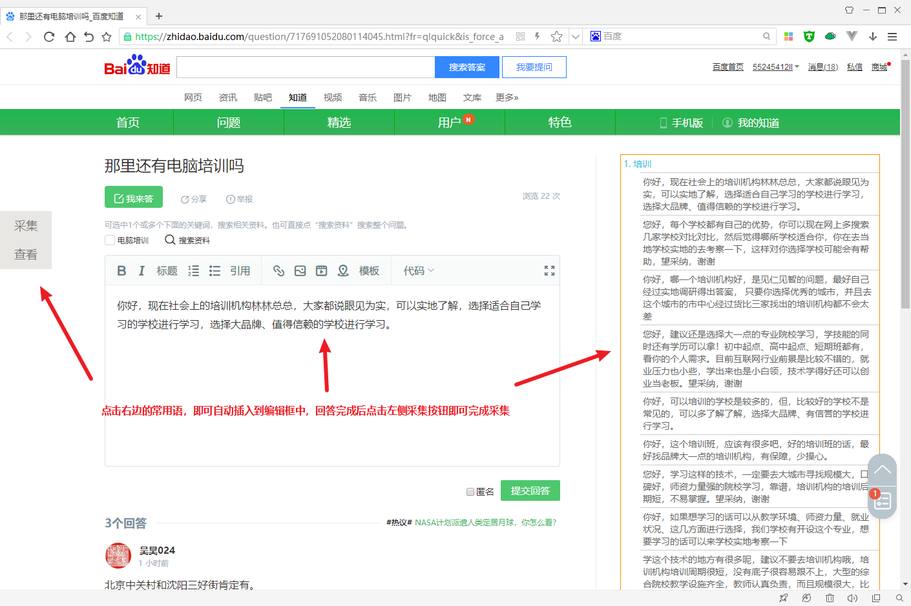

### 说明
因在校兼职需求而被制造出来的Chrome浏览器扩展（插件），交给学校网络宣传部使用，使用JavaScript和jQuery。主要用途是快速采集网页上的链接、标题、账号等信息并生成表格，目前支持百度贴吧、百度知道、360问答、搜狗问问、悟空问答、兴趣部落、赶集网、百姓网。使得工作效率提升100+%，目前已更新20个版本。

GitHub地址：https://github.com/1171736840/WebDataCollector

### 截图

